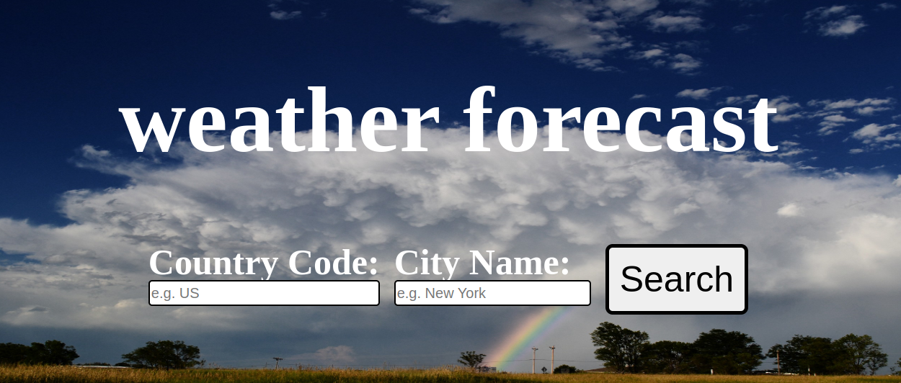
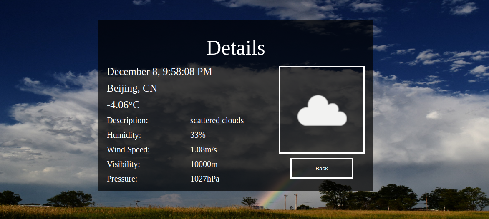

# 12.odin_weather_app

[Task Description](https://www.theodinproject.com/lessons/node-path-javascript-weather-app)

[Live Preview](https://maxim55069633.github.io/12.odin_weather_app/)

In this project, I create a weather forecast app. 

I learn:
1. Use "promise", "then", "catch" to write asynchronous code and handle errors.
2. Use the OpenWeather API to fetch related details.
3. Add a loading component from [website](https://loading.io/) when asynchronous code hasn't been complete.

sample:
1. 

2. 

I use the following image from bing under the license: free to share and use commercially
[rainbow](https://cn.bing.com/images/search?view=detailV2&ccid=1dDrK1O6&id=6CD5530C94002145F179DC996ECDD5E7BD7E9E09&thid=OIP.1dDrK1O6gAC-YyZUCGNrEgHaE8&mediaurl=https%3a%2f%2fcoclouds.com%2fwp-content%2fuploads%2f2011%2f07%2fmammatus-clouds-with-rainbow-2011-07-21.jpg&exph=1728&expw=2592&q=rainbow&simid=608037803219174082&FORM=IRPRST&ck=9CF23653218CF6665AF401BACC268653&selectedIndex=3&qft=+filterui%3alicense-L2_L3_L4&ajaxhist=0&ajaxserp=0)
