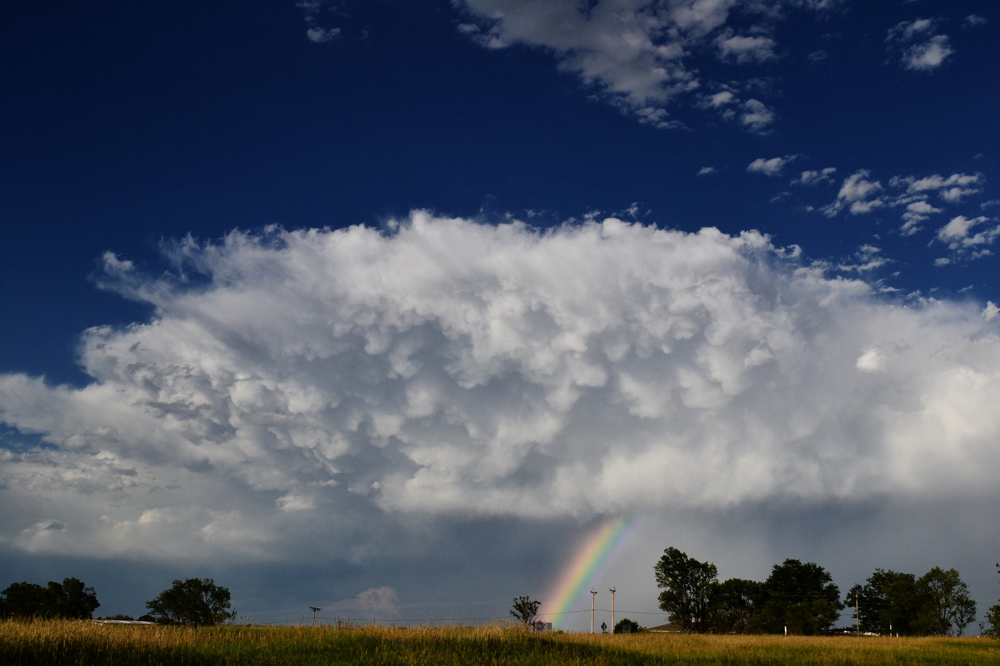

# 12.odin_weather_app

[Task Description](https://www.theodinproject.com/lessons/node-path-javascript-weather-app)

[Live Preview](https://maxim55069633.github.io/12.odin_weather_app/)

In this project, I create a weather forecast app. 

I learn:
1. Use "promise", "then", "catch" to write asynchronous code and handle errors.
2. Use the OpenWeather API to fetch related details.
3. Add a loading component from [website](https://loading.io/) when asynchronous code hasn't been complete.

sample:
1. 

2. 

I use the following image from bing under the license: free to share and use commercially

